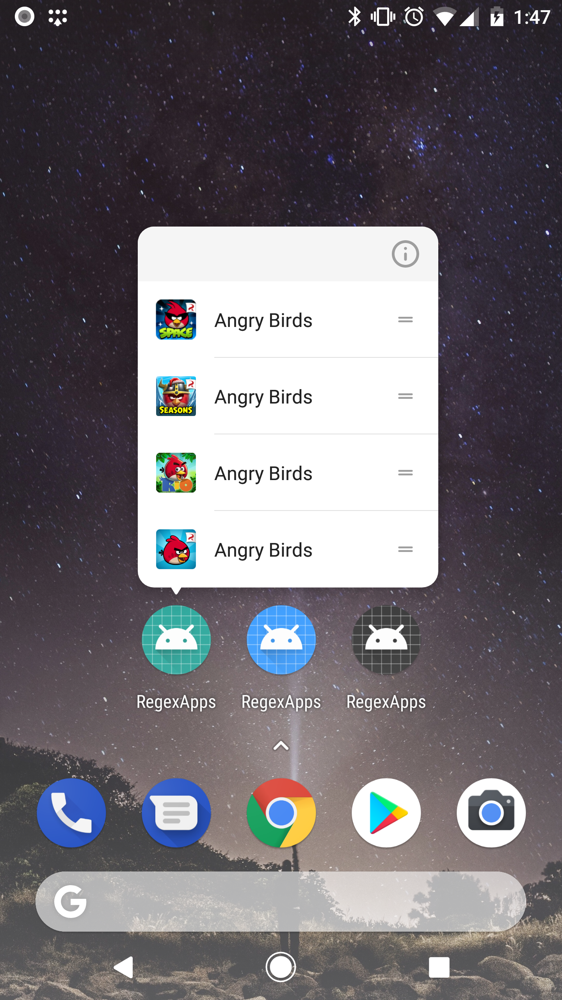
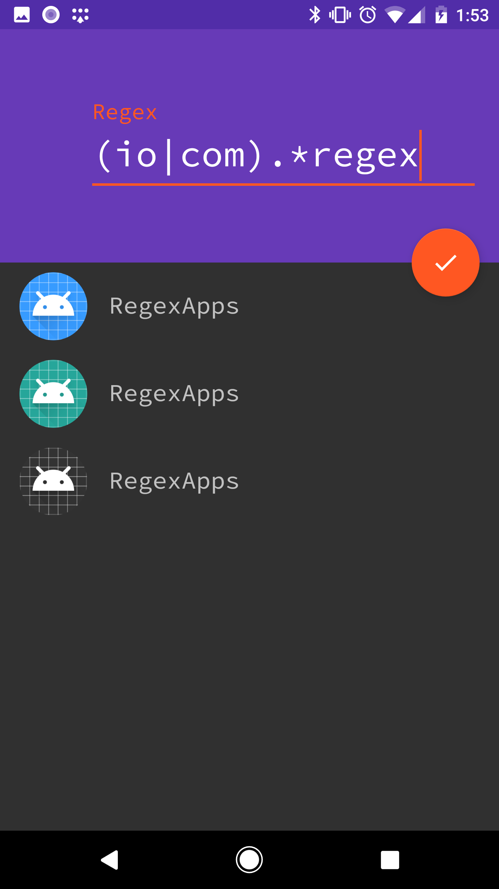

# Regex Apps
A developer tool written in Kotlin to provide dynamic app shortcuts for the set of apps matching a regular expression. Multiple app variants are provided so that you can have a copy of the app for Home, Work, and Other.

 

## Install
Install all variants with: `./gradlew installDebug`

or

Choose your desired flavors:
- `./gradlew installHomeDebug`
- `./gradlew installWorkDebug`
- `./gradlew installOtherDebug`
